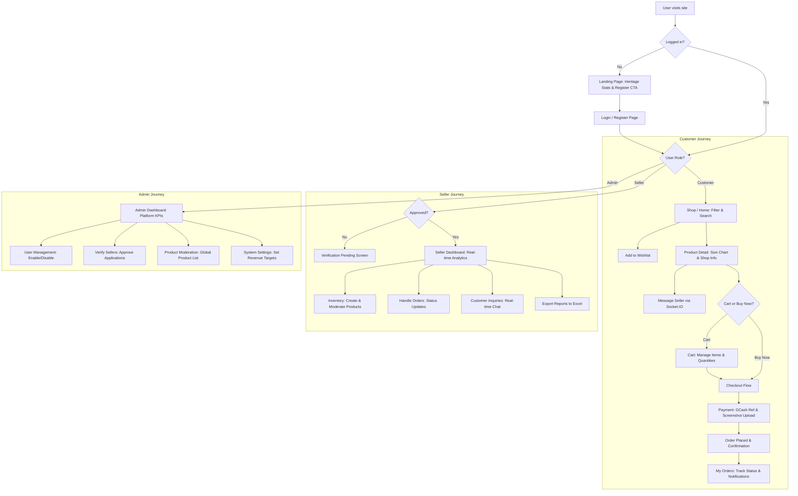

# 🇵🇭 Lumbarong System — Full Walkthrough

> A comprehensive overview of the Lumbarong e-commerce platform for Philippine heritage barong crafts — covering the tech stack, architecture, and every page/feature across all three user roles.

---

## 1. Languages Used

| Language | Purpose |
|---|---|
| **JavaScript** | Backend (Node.js) and Frontend (Next.js/React) — the primary language of the system |
| **Dart** | Flutter mobile companion app |
| **SQL** | MySQL relational database queries and schema |
| **TypeScript** | Config-only ([capacitor.config.ts](file:///c:/xampp/htdocs/lumbarong-main/frontend/capacitor.config.ts)) |

---

## 2. Tech Stack at a Glance

### 🔵 Backend
| Tool | Role |
|---|---|
| **Node.js** | Server runtime |
| **Express.js v5** | REST API framework |
| **Sequelize v6** | ORM for database models |
| **MySQL** | Relational database |
| **Socket.IO v4** | Real-time messaging and live dashboard updates |
| **JWT + bcryptjs** | Authentication and password hashing |
| **Multer + Cloudinary** | File/image uploads stored in the cloud |
| **Helmet + express-rate-limit** | Security hardening |
| **ExcelJS** | Analytics data export to `.xlsx` |
| **Nodemon + Jest + Supertest** | Dev tooling and testing |

### 🖥️ Frontend
| Tool | Role |
|---|---|
| **Next.js v15** | React framework with Pages Router |
| **React v19** | UI component library |
| **Tailwind CSS v4** | Utility-first styling |
| **Framer Motion** | Page and component animations |
| **Lucide React** | Icon library |
| **Axios** | HTTP client for API calls |
| **Recharts** | Charts and data visualizations |
| **Socket.IO Client** | Real-time updates on the frontend |
| **Capacitor v8** | Wraps the web app into Android/iOS apps |

### 📱 Flutter Mobile App
| Tool | Role |
|---|---|
| **Flutter / Dart** | Cross-platform mobile framework |
| **Dio** | HTTP client |
| **Provider** | State management |
| **go_router** | Client-side navigation |
| **shared_preferences** | Local token/session storage |
| **cached_network_image** | Optimized remote image loading |
| **Google Fonts** | Custom typography |

### ☁️ Infrastructure
| Tool | Role |
|---|---|
| **Cloudinary** | Cloud storage for product/upload images |
| **MySQL / XAMPP** | Local relational database |
| **Docker** | Backend containerization |
| **Vercel** | Frontend deployment |
| **PowerShell scripts** | [start.ps1](file:///c:/xampp/htdocs/lumbarong-main/start.ps1) to run servers, [fix_db.ps1](file:///c:/xampp/htdocs/lumbarong-main/fix_db.ps1) for DB fixes |

---

## 3. Design System, Layout Themes & Backgrounds

### 🎨 Color Palette

The entire system uses a **warm artisan / heritage** color palette — earthy tones inspired by Philippine craft culture, defined as CSS custom properties in [globals.css](file:///c:/xampp/htdocs/lumbarong-main/frontend/src/styles/globals.css):

| Token | Hex | Usage |
|---|---|---|
| `cream` | `#F7F3EE` | Global page background |
| `warm-white` | `#FDFAF7` | Card and panel backgrounds |
| `charcoal` | `#1C1917` | Primary text and headings |
| `bark` | `#3D2B1F` | Primary button background |
| `rust` | `#C0422A` | Brand accent, active states, links |
| `rust-light` | `#E8604A` | Button hover gradient |
| `sand` | `#D4B896` | Muted labels, placeholders |
| `sage` | `#8FA882` | Secondary accent (seller charts) |
| `muted` | `#8C7B70` | Secondary text, disabled states |
| `border` | `#E5DDD5` | All card and section borders |
| `input-bg` | `#F9F6F2` | Search bars and form fields |
| `green` | `#4A9E6A` | Success / completed status |
| `amber` | `#C47C1A` | Warning / pending status |
| `blue` | `#3B7FD4` | Info / system labels |

### 🔤 Typography

| Font | Role | Source |
|---|---|---|
| **Cormorant Garamond** | Headings, logo text, display numbers | Google Fonts (serif) |
| **Inter** | Body text, labels, buttons, all UI | Google Fonts (sans-serif) |

- **Headings** use `font-serif` (Cormorant Garamond) with proportional numerals
- **Body/UI** uses `font-sans` (Inter) with tabular numerals for price alignment
- Fluid heading size on landing: `clamp(3rem, 8vw, 5.5rem)`
- Font smoothing enabled globally via `-webkit-font-smoothing: antialiased`

### 🖼️ Background Colors by Section

| Area | Background | Notes |
|---|---|---|
| **Global page** | `#F7F3EE` (Cream) | All authenticated pages |
| **Sidebar** | `#FFFFFF` (White) | Bordered with `#E5DDD5` |
| **Top Header** | `#FFFFFF` (White) | 72px sticky bar, bottom border |
| **Content cards** | `#FFFFFF` (White) | Rounded-2xl, soft shadow |
| **Form inputs** | `#F9F6F2` (Input-bg) | Focused: white + rust border |
| **Active nav item** | `rgba(192,66,42,0.09)` | Rust tint with left border accent |
| **Landing page** | `#fdfbf7` + artisan hero image | Full-bleed gradient overlay left |
| **Seller dashboard** | `#f4ece3` (warm beige) | Unique warm background for seller |
| **Button primary hover** | `linear-gradient(135deg, #E8604A, #C0422A)` | Rust gradient on hover |

### 🏛️ Layout Structure (All Roles)

All three layout types (**Customer**, **Seller**, **Admin**) share the same core shell:

```
┌─────────────────────────────────────────────┐
│  Sidebar (280px, white, fixed left)         │
│  - Logo + role label                        │
│  - Grouped navigation links                 │
│  - User profile card (bottom)               │
├─────────────────────────────────────────────┤
│  Top Header (72px, sticky, white)           │
│  - Search bar (left)                        │
│  - Cart / Bell / Date / Logout (right)      │
├─────────────────────────────────────────────┤
│  Content Area (flex-1, overflow-y-auto)     │
│  - Page content with padding                │
│  - Max-width: 1400px centered               │
└─────────────────────────────────────────────┘
```

On **mobile** (< lg breakpoint): sidebar collapses and slides in from the left as an animated drawer (Framer Motion `x: -280 → 0`).

### 🎭 Role-Specific Design Themes

| Role | Sidebar Label | Sidebar Icon | Accent Color | Background |
|---|---|---|---|---|
| **Customer** | "CUSTOMER SIDE" | Shopping Bag | Rust `#C0422A` | Cream `#F7F3EE` |
| **Seller** | "SELLER WORKSHOP" | Store icon | Rust `#C0422A` | Cream `#F7F3EE` |
| **Admin** | "ADMINISTRATION" | Shield icon | Rust `#C0422A` | Cream `#F7F3EE` |

All roles share the same rust accent and cream base but have different sidebar role labels and icons.

### ✨ Animation System

All animations are CSS keyframe-based, defined in [globals.css](file:///c:/xampp/htdocs/lumbarong-main/frontend/src/styles/globals.css):

| Class | Effect | Duration |
|---|---|---|
| `animate-fade-down` | Slides in from top (`Y: -14px → 0`) | 0.55s ease |
| `animate-fade-up` | Slides in from bottom (`Y: 16px → 0`) | 0.55s ease |
| `animate-row-in` | Slides in from right (`X: 6px → 0`) | 0.35s ease |
| Framer Motion | Product cards, sidebar drawer, modals, notification panel | Dynamic |
| `transition-all` | Hover states on buttons, nav items, cards | TailwindCSS |

Product cards on the home page use **Framer Motion staggered entrance** — each card animates in with a 50ms delay per item (`delay: i * 0.05`).

### 🧩 Reusable UI Component Styles

| Component Class | Description |
|---|---|
| `.btn-primary` | Dark bark background, rust gradient hover, translateY lift |
| `.artisan-card` | White bg, `#E5DDD5` border, 14px radius, artisan shadow |
| `.eyebrow` | Small uppercase red label with a left bar (`::before`) — used for section headings |
| `.status-badge` | Pill for order status (Pending/Processing/Shipped/Delivered) |
| `.section-divider` | Horizontal rule with a centered label (used in sidebars) |
| `.nav-item` | Sidebar link with left border accent on active state |
| `.shadow-artisan` | Subtle warm shadow `0 10px 40px rgba(60,40,20,0.06)` |

---

## 4. Charts & Visualizations

The platform relies heavily on **Recharts** for data visualization across the Seller and Admin dashboards, along with custom CSS-based visualizations.

### 📈 Admin Dashboard Visualizations

| Chart Type | Name | Purpose | Customization |
|---|---|---|---|
| **BarChart** | *Earning Statistics* | Displays total revenue over different periods | Custom colors (`#d26a4e`, `#889e81`), transparent tooltip, hidden axis lines |
| **PieChart** | *Sales Target* | Donut chart showing daily and monthly revenue against custom numerical targets | Concentric donuts, dynamically calculates fill vs. empty (`#f3f4f6`) |
| **LineChart** | *User Hit Rate* | Shows active platform engagement over time | Monotone curve, custom active dot, customized drop-shadow tooltip |
| **Custom CSS Bar** | *All Customers* | Location-based customer breakdown | Rounded progress bars stacked vertically using Tailwind utility classes (`w-full`, `bg-rust`, `transition-all`) |

### 📊 Seller Dashboard Visualizations

| Chart Type | Name | Purpose | Customization |
|---|---|---|---|
| **AreaChart** | *Total Sales* | Visualizes shop revenue performance in real-time | Custom `linearGradient` fill (`#colorSalesPremium`), smooth monotone curve (`stroke="#c14a38"`) |
| **LineChart** | *Avg. Lifetime Revenue* | Multi-line cohort analysis (e.g., Jan '22 vs Mar '22 sales over time) | Dynamic line rendering matching cohort length, `connectNulls=true`, custom tooltip |
| **Custom CSS Heatmap**| *Customer Retention* | Grid showing percentage of returning customers by month | Values trigger different background colors (e.g. `bg-[#c14a38]` for high retention, `bg-[#f3dad6]` for low) |
| **Custom CSS Funnel** | *Sales Funnel* | Shows drop-off rates from Visitor → Order | Custom HTML bars of varying heights, grid layout with calculated abandonment rates |

---

## 5. System Architecture

```
┌─────────────────────────────────────────┐
│        Frontend (Next.js / React)       │
│   Web app — Customer, Seller, Admin     │
└──────────────┬──────────────────────────┘
               │  REST API + WebSocket (Socket.IO)
┌──────────────▼──────────────────────────┐
│      Backend (Node.js / Express)        │
│   Auth · Products · Orders · Chat       │
└──────────────┬──────────────────────────┘
               │  Sequelize ORM
┌──────────────▼──────────────────────────┐
│           MySQL Database                │
│  Users · Products · Orders · Messages   │
└─────────────────────────────────────────┘

┌─────────────────────────────────────────┐
│     Flutter Mobile App (Dart)          │
│  Companion app for Android / iOS        │
└─────────────────────────────────────────┘
```

The backend exposes a versioned REST API (`/api/v1/...`) consumed by both the Next.js web frontend and the Flutter mobile app. Socket.IO enables real-time features like chat messaging and live dashboard refreshes.

---

## 6. Database Models

| Model | Description |
|---|---|
| `User` | Stores customers, sellers, and admins with role flags |
| `Product` | Product listings with images, price, sizes, category |
| `Order` | Orders linking customers to products with status tracking |
| `Category` | Product category taxonomy |
| `Message` | Real-time chat messages between buyers and sellers |
| [Notification](file:///c:/xampp/htdocs/lumbarong-main/frontend/src/components/AdminLayout.js#81-90) | System and order notifications per user |
| `Address` | Customer shipping addresses |
| `Wishlist` | Saved/favorited products per customer |
| `SystemSetting` | Admin-controlled platform settings (e.g., sales targets) |

---

## 7. Backend API Routes

| Route Group | Endpoints |
|---|---|
| `authRoutes` | Register, Login, Logout, Profile, Stats |
| `productRoutes` | CRUD products, search, filter by category |
| `orderRoutes` | Create order, list orders, update status |
| `categoryRoutes` | List and manage categories |
| `chatRoutes` | Fetch message threads, send messages |
| `notificationRoutes` | Get and mark notifications |
| `wishlistRoutes` | Add/remove/list wishlist items |
| `userRoutes` | Update profile, change password, manage addresses |
| `adminRoutes` | Dashboard stats, seller verification |
| `analyticsRoutes` | Seller analytics (revenue, trends, cohort, export) |
| `uploadRoutes` | Cloudinary image upload endpoints |

---

## 8. Shared Frontend Components

| Component | What It Does |
|---|---|
| [CustomerLayout.js](file:///c:/xampp/htdocs/lumbarong-main/frontend/src/components/CustomerLayout.js) | Wraps all customer pages — side navbar, top bar with search, cart, notifications |
| [SellerLayout.js](file:///c:/xampp/htdocs/lumbarong-main/frontend/src/components/SellerLayout.js) | Wraps all seller pages — side navbar with seller nav links |
| [AdminLayout.js](file:///c:/xampp/htdocs/lumbarong-main/frontend/src/components/AdminLayout.js) | Wraps all admin pages — side navbar with admin nav links |
| [ChatBox.js](file:///c:/xampp/htdocs/lumbarong-main/frontend/src/components/ChatBox.js) | Floating real-time chat widget powered by Socket.IO |
| [ProductCard.js](file:///c:/xampp/htdocs/lumbarong-main/frontend/src/components/ProductCard.js) | Reusable card showing product image, name, price, wishlist button |
| [Navbar.js](file:///c:/xampp/htdocs/lumbarong-main/frontend/src/components/Navbar.js) | Top navigation bar |
| [Footer.js](file:///c:/xampp/htdocs/lumbarong-main/frontend/src/components/Footer.js) | Site-wide footer |

---

## 9. Public Pages (No Login Required)

````carousel
### 🏠 Landing Page (`/`)
The first page visitors see before logging in.

**Features:**
- Full-screen hero section with a barong artisan background image
- Animated headline: *"Wear the Spirit of the Philippines"*
- Live stats pulled from the API: number of artisans, products, and average rating
- CTA buttons: **Start Your Heritage Journey** (Register) and **Sign In**
- Navigation links: Heritage Guide · About Us · Privacy Policy · Terms of Use
- Footer with site info

<!-- slide -->

### 🔐 Login (`/login`)
Standard login form.

**Features:**
- Email and password fields
- JWT-based authentication
- Role-based redirect after login:
  - Customers → Home/Shop
  - Sellers → Seller Dashboard
  - Admins → Admin Dashboard

<!-- slide -->

### 📝 Register (`/register`)
Customer account creation.

**Features:**
- Full name, email, password fields
- Indigency certificate upload (required for community verification)
- After successful registration, redirects to Login page

<!-- slide -->

### 📖 Heritage Guide (`/heritage-guide`)
Informational page about Lumban's cultural heritage.

**Features:**
- Rich editorial content about traditional barong craftsmanship
- History and cultural significance of Lumban embroidery

<!-- slide -->

### ℹ️ About / Privacy / Terms
Static informational pages.

**Includes:**
- `/about` — About the Lumbarong platform and its mission
- `/privacy-policy` — User data and privacy information
- `/terms` — Terms and conditions of use
````

---

## 10. Customer Pages

````carousel
### 🛍️ Home / Shop (`/`)
The main product browsing page for logged-in customers.

**Features:**
- Hero banner with animated category filter bar
- Category filter buttons (All, Formal, Casual, etc.) with expand/collapse
- URL-based search (`?search=`) for keyword queries
- Responsive product grid (2–5 columns depending on screen size)
- Animated product cards via Framer Motion
- "Find Similar" support — auto-selects a category via URL query param

<!-- slide -->

### 👕 Product Detail (`/products/[id]`)
Full product information page for a single item.

**Features:**
- Product image gallery
- Product name, description, price, available sizes
- Size chart modal popup
- **Add to Cart** button
- **Buy Now** button (goes straight to buy-now flow)
- **Wishlist** toggle (heart icon)
- **"Find Similar"** link (filters shop by same category)
- **Message Seller** button — opens real-time chat
- Seller shop info and link

<!-- slide -->

### 🏪 Shop by Seller (`/shop/[id]`)
Browse all products from one specific seller.

**Features:**
- Seller banner and shop name
- Full product grid filtered to that seller
- Link to message the seller

<!-- slide -->

### 🛒 Cart (`/cart`)
Shopping cart management.

**Features:**
- List of all cart items with image, name, size, price
- Quantity increment/decrement per item
- Remove item from cart
- Order total and subtotal summary
- Proceed to Checkout button

<!-- slide -->

### ⚡ Buy Now (`/buy-now`)
Streamlined single-item purchase flow.

**Features:**
- Skip-cart direct purchase for one product
- Shipping and payment step same as Checkout

<!-- slide -->

### 💳 Checkout (`/checkout`)
Full order placement flow.

**Features:**
- Shipping address form (add new or select saved address)
- Payment method selection modal — GCash only
- GCash reference number input
- Screenshot proof upload
- **Validation modal** — if any required info is missing, lists exactly what is needed with action buttons
- Order confirmation on success

<!-- slide -->

### 📦 Orders (`/orders`)
Order history and tracking.

**Features:**
- Full list of past and active orders
- Order status display: Pending → Processing → Shipped → Delivered
- Order details (items, total, address, payment)
- Order date and reference info

<!-- slide -->

### ❤️ Wishlist (`/wishlist`)
Saved favorite products.

**Features:**
- Grid of wishlisted products
- Remove from wishlist
- Quick Add to Cart button per item

<!-- slide -->

### 💬 Messages (`/messages`)
Real-time buyer–seller chat.

**Features:**
- List of all message threads with sellers
- Real-time chat powered by Socket.IO
- Message timestamps
- "View Shop" link for each seller

<!-- slide -->

### 🔔 Notifications (`/notifications`)
System and order alert feed.

**Features:**
- List of all notifications (new order, status update, system alerts)
- Click notification → redirects to the relevant page

<!-- slide -->

### 👤 Profile (`/profile`)
Customer account management.

**Features:**
- Edit display name and email address
- **Security section** — change password (current + new + confirm)
- Manage saved shipping addresses (add, edit, delete)
- Profile photo update
````

---

## 11. Seller Pages

````carousel
### 📊 Seller Dashboard (`/seller/dashboard`)
The central analytics hub for sellers.

**Features:**
- **Total Sales area chart** — revenue over selected date range
- **KPI summary bar** — Revenue · Orders · Average Order Value · Chat Inquiries
- **Sales Funnel chart** — Visitors → Product Views → Add to Cart → Checkout → Completed
- **Avg. Lifetime Revenue chart** — multi-line cohort comparison
- **Customer Retention heatmap** — cohort-based retention percentages
- **Date range filter** — Today, This Week, This Month, Last 3/6 Months, Last Year, All Time
- **Export button** — downloads analytics as Excel (`.xlsx`)
- Real-time updates via Socket.IO
- Verification pending banner if shop not yet approved

<!-- slide -->

### ➕ Add Product (`/seller/add-product`)
Create a new product listing.

**Features:**
- Product name, description, price fields
- Category selection dropdown
- Size and fabric/material fields
- Multiple image upload (stored on Cloudinary)
- Submit to publish listing

<!-- slide -->

### 📦 Inventory (`/seller/inventory`)
Manage existing product listings.

**Features:**
- Full list of seller's own products
- Edit product details inline or via form
- Delete/remove a listing
- Stock quantity management

<!-- slide -->

### 🧾 Seller Orders (`/seller/orders`)
Manage incoming customer orders.

**Features:**
- List of all orders for this seller's products
- Order status management: Pending → Processing → Shipped → Delivered
- View buyer name, address, payment proof
- Order item details and total

<!-- slide -->

### 👤 Seller Profile (`/seller/profile`)
Edit shop identity.

**Features:**
- Update shop name and description
- Upload/change profile/shop photo via Cloudinary
- View account verification status

<!-- slide -->

### 🧑 Customer Detail (`/seller/customer/[id]`)
View a specific buyer's info.

**Features:**
- Customer name and contact details
- Order history specific to this seller's shop
````

---

## 12. Admin Pages

````carousel
### 📈 Admin Dashboard (`/admin/dashboard`)
Platform-wide analytics and monitoring.

**Features:**
- **4 stat cards** — Total Sales (₱), Total Orders, Total Customers, Total Products
- **Earning Statistics bar chart** — sales by time period
- **Sales Target donut chart** — daily and monthly targets with editable inputs
- **Customer by Location** — bar chart broken down by city
- **User Hit Rate line chart** — trend of platform engagement over time
- **Recent Activity feed** — new seller registrations, sales events
- All data refreshes in real-time via Socket.IO (also on window focus)

<!-- slide -->

### 👥 Users (`/admin/users`)
Manage all customer accounts.

**Features:**
- Full list of registered customers
- Search and filter users
- View user profile info
- Enable/disable accounts

<!-- slide -->

### 🏪 Sellers (`/admin/sellers`)
Manage seller applications and verification.

**Features:**
- Full list of seller accounts (pending and approved)
- Approve or reject seller verification applications
- View seller shop details and uploaded documents
- Search and filter by status

<!-- slide -->

### 🗂️ Products (`/admin/products`)
Moderate all product listings.

**Features:**
- View all products across all sellers
- Search and filter products
- Remove inappropriate or violating listings

<!-- slide -->

### ⚙️ Settings (`/admin/settings`)
Platform configuration.

**Features:**
- Set daily and monthly revenue targets (reflected on dashboard)
- Manage other system-wide settings
````

---

## 13. Real-Time Features Summary

| Feature | Technology |
|---|---|
| Buyer–Seller chat messaging | Socket.IO rooms per conversation thread |
| Admin dashboard live refresh | Socket.IO `dashboard_update` event |
| Seller dashboard live refresh | Socket.IO `dashboard_update` event |
| Window focus refresh | `window.addEventListener('focus', ...)` |

---

## 14. Key User Flows


